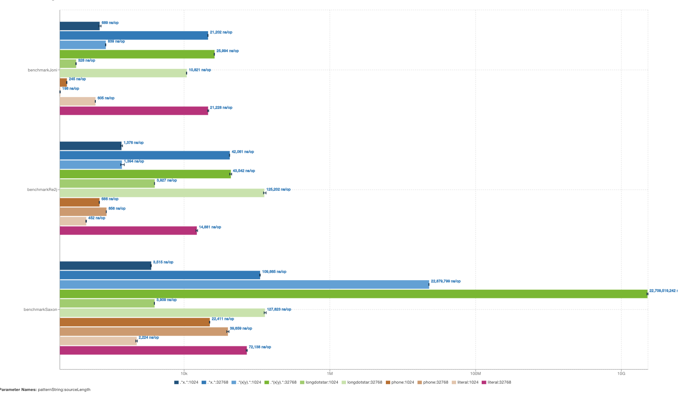

[Benchmark](src/test/java/io/github/piotrrzysko/BenchmarkRegex.java) results:




```
Benchmark                      (patternString)  (sourceLength)  Mode  Cnt            Score            Error  Units
BenchmarkRegex.benchmarkJoni             .*x.*            1024  avgt    5          689.373 ±         80.604  ns/op
BenchmarkRegex.benchmarkJoni             .*x.*           32768  avgt    5        21201.767 ±        484.535  ns/op
BenchmarkRegex.benchmarkJoni         .*(x|y).*            1024  avgt    5          838.673 ±         19.092  ns/op
BenchmarkRegex.benchmarkJoni         .*(x|y).*           32768  avgt    5        25993.759 ±        490.358  ns/op
BenchmarkRegex.benchmarkJoni       longdotstar            1024  avgt    5          327.839 ±          6.766  ns/op
BenchmarkRegex.benchmarkJoni       longdotstar           32768  avgt    5        10821.296 ±        180.458  ns/op
BenchmarkRegex.benchmarkJoni             phone            1024  avgt    5          244.519 ±          5.380  ns/op
BenchmarkRegex.benchmarkJoni             phone           32768  avgt    5          198.158 ±          5.290  ns/op
BenchmarkRegex.benchmarkJoni           literal            1024  avgt    5          605.237 ±          6.937  ns/op
BenchmarkRegex.benchmarkJoni           literal           32768  avgt    5        21227.692 ±       1188.540  ns/op
BenchmarkRegex.benchmarkRe2j             .*x.*            1024  avgt    5         1375.557 ±        118.711  ns/op
BenchmarkRegex.benchmarkRe2j             .*x.*           32768  avgt    5        42060.641 ±        533.249  ns/op
BenchmarkRegex.benchmarkRe2j         .*(x|y).*            1024  avgt    5         1393.613 ±        262.933  ns/op
BenchmarkRegex.benchmarkRe2j         .*(x|y).*           32768  avgt    5        43542.285 ±       4292.338  ns/op
BenchmarkRegex.benchmarkRe2j       longdotstar            1024  avgt    5         3926.603 ±         15.608  ns/op
BenchmarkRegex.benchmarkRe2j       longdotstar           32768  avgt    5       125202.415 ±      16870.283  ns/op
BenchmarkRegex.benchmarkRe2j             phone            1024  avgt    5          686.417 ±         13.273  ns/op
BenchmarkRegex.benchmarkRe2j             phone           32768  avgt    5          856.213 ±          3.523  ns/op
BenchmarkRegex.benchmarkRe2j           literal            1024  avgt    5          451.999 ±         12.776  ns/op
BenchmarkRegex.benchmarkRe2j           literal           32768  avgt    5        14881.122 ±       1526.307  ns/op
BenchmarkRegex.benchmarkSaxon            .*x.*            1024  avgt    5         3514.841 ±        128.520  ns/op
BenchmarkRegex.benchmarkSaxon            .*x.*           32768  avgt    5       109665.420 ±       3726.770  ns/op
BenchmarkRegex.benchmarkSaxon        .*(x|y).*            1024  avgt    5     22879799.160 ±     205255.245  ns/op
BenchmarkRegex.benchmarkSaxon        .*(x|y).*           32768  avgt    5  22709519241.800 ± 1206917025.869  ns/op
BenchmarkRegex.benchmarkSaxon      longdotstar            1024  avgt    5         3908.948 ±         47.639  ns/op
BenchmarkRegex.benchmarkSaxon      longdotstar           32768  avgt    5       127822.569 ±      12611.595  ns/op
BenchmarkRegex.benchmarkSaxon            phone            1024  avgt    5        22410.901 ±        420.463  ns/op
BenchmarkRegex.benchmarkSaxon            phone           32768  avgt    5        39659.187 ±       4300.797  ns/op
BenchmarkRegex.benchmarkSaxon          literal            1024  avgt    5         2223.962 ±        196.747  ns/op
BenchmarkRegex.benchmarkSaxon          literal           32768  avgt    5        72138.417 ±       3916.059  ns/op
```
